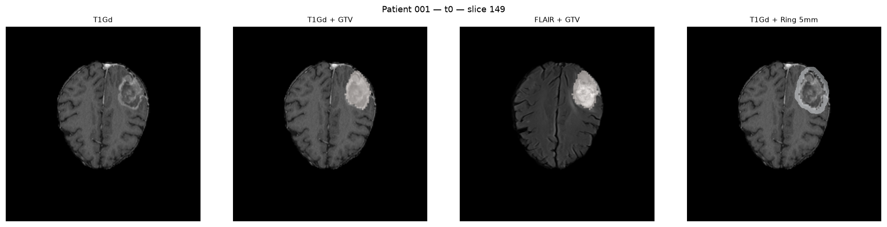
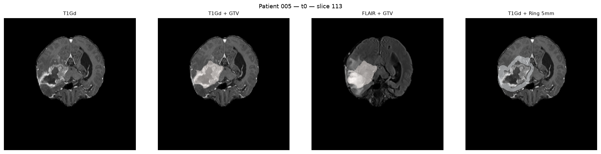
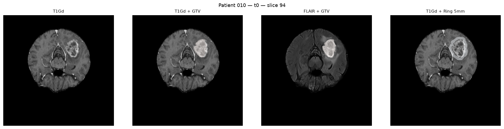
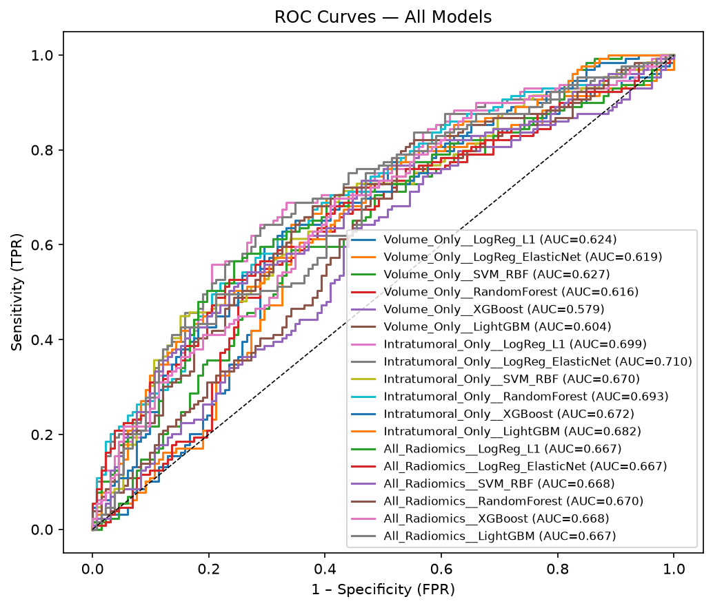
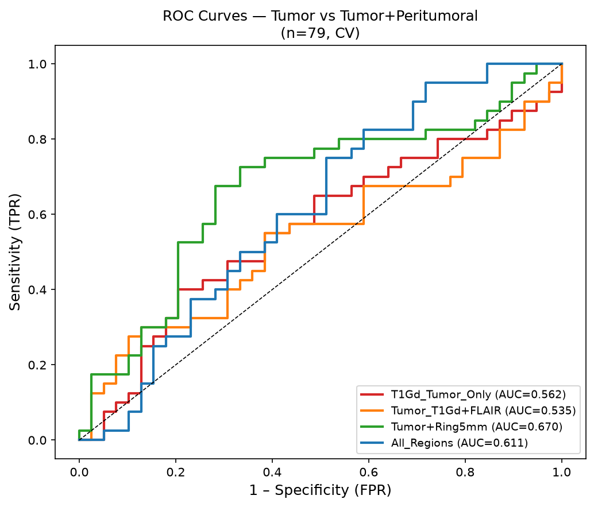
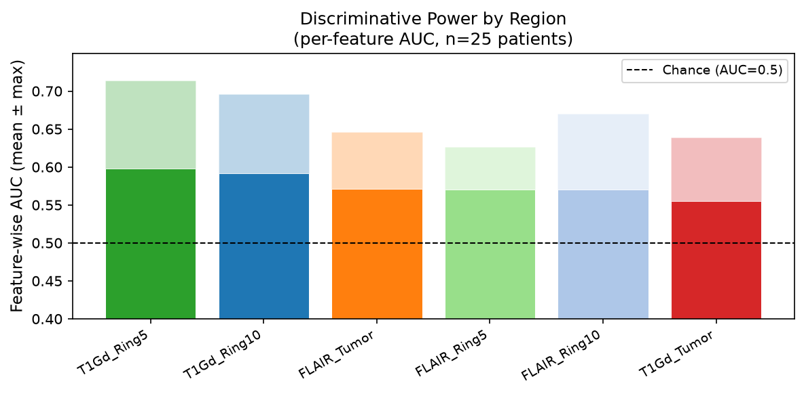
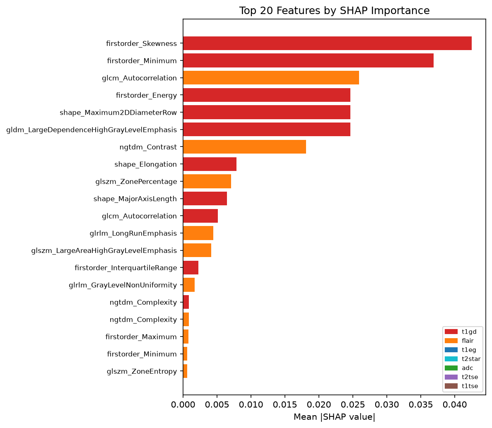
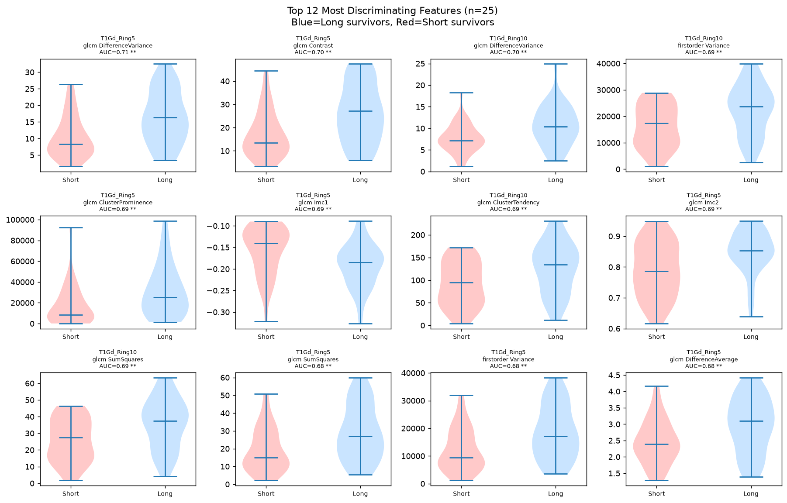

# 🧠 AI-Driven MRI Radiomics for Glioblastoma

**Quantitative Features Beyond Visible Segmentation — Outcome Prediction & Explainable AI**


> **Course seminar project** · Not a clinically validated tool · Raw patient data not included

---

## What This Project Does

Glioblastoma (GBM) is the most aggressive primary brain tumour. Standard clinical imaging measures only the *visible* contrast-enhancing tumour. But GBM infiltrates **2–3 cm beyond the visible boundary** — and that tissue contains hidden prognostic signals.

This pipeline asks: **can quantitative radiomic features from the tissue surrounding the tumour predict survival better than visible tumour measurements alone?**

**Answer: Yes — adding peritumoral ring features improves AUC by +19% over tumour-only.**

---

## Key Results

| Cohort | Experiment | Best Model | AUC | 95% CI |
|--------|-----------|-----------|-----|--------|
| 261 patients (TSV) | Volume Only (baseline) | SVM-RBF | 0.627 | 0.562–0.692 |
| 261 patients (TSV) | **Intratumoral Radiomics** | **LogReg ElasticNet** | **0.710** | **0.648–0.767** |
| 79 patients (NIfTI) | T1Gd Tumor Only | RandomForest | 0.562 | 0.437–0.688 |
| 79 patients (NIfTI) | **Tumor + Ring 5mm** | **LogReg L1** | **0.670** | **0.545–0.794** |

### Peritumoral Region Discriminative Power

| Region | Mean AUC | Best Single Feature AUC |
|--------|----------|------------------------|
| 🟢 T1Gd Ring 5mm | **0.598** | **0.714** |
| 🔵 T1Gd Ring 10mm | **0.591** | 0.696 |
| 🟠 FLAIR Tumor | 0.571 | 0.646 |
| 🔴 T1Gd Tumor | 0.556 | 0.639 |

> **T1Gd peritumoral rings outperform intratumoral features** — consistent with GBM biology: vascular permeability changes in the peritumoral zone reflect infiltrating tumour cells invisible to clinical assessment.

---

## Pipeline Overview

```
Download NIfTI (TCIA)
        ↓
Create Peritumoral Rings (5mm, 10mm morphological dilation)
        ↓
Extract PyRadiomics Features (6 regions × 56 features = 336/patient)
        ↓
Train ML Models (LogReg · SVM · RandomForest · XGBoost)
        ↓
5-fold Stratified CV + Bootstrap 95% CI
        ↓
SHAP Explainability (TreeExplainer / KernelExplainer)
        ↓
Region Discriminative Power Analysis
```

---

## Sample Figures

### MRI Regions — Patient Examples
*Left→Right: T1Gd (raw) | T1Gd + GTV mask | FLAIR + GTV mask | T1Gd + Ring 5mm (blue)*





> **Key observation:** Panel 3 (FLAIR + GTV) shows the bright FLAIR signal extending far beyond the red GTV contour. This is the infiltration zone captured by the peritumoral rings (Panel 4, blue). This tissue is routinely ignored in clinical assessment — but our analysis shows it contains the highest discriminative signal.

---

### ROC Curves — 261-Patient Cohort
*Intratumoral radiomics (AUC=0.710) clearly outperforms volume-only baseline (AUC=0.627)*



---

### Peritumoral Comparison — 79 Patients
*Adding Ring 5mm features: AUC 0.562 → 0.670 (+19%)*



---

### Region Discriminative Power
*T1Gd rings rank above intratumoral features in per-feature discriminative AUC*



---

### SHAP Explainability — Feature Attribution
*Top features by mean absolute SHAP value, coloured by region of origin*



---

### Top Discriminating Features — Violin Plots
*Long vs Short survivors. Blue=Long, Red=Short. AUC and p-value shown per feature.*



---

## AI Components

This project integrates three complementary layers of artificial intelligence:

**I. Supervised Machine Learning** — Four classifiers (Logistic Regression, SVM, Random Forest, XGBoost) are trained to predict patient survival class directly from radiomic imaging features. Automated feature selection (ANOVA F-score, SelectKBest) identifies the most discriminating features without manual intervention.

**II. Explainable Artificial Intelligence (XAI)** — SHAP (SHapley Additive exPlanations) decomposes each model prediction into individual feature contributions using cooperative game theory. This produces per-patient, per-feature attribution maps that allow biological interpretation of model decisions — addressing the "black box" problem inherent to complex ML models.

**III. Deep Learning (optional)** — A 3D Residual Neural Network (ResNet) extracts 128-dimensional embeddings directly from volumetric MRI patches, learning spatial features without manual feature engineering. Implemented in `src/train_deep_embeddings.py`; requires an NVIDIA GPU (≥48 GB VRAM).

| Layer | Method | Purpose |
|-------|--------|---------|
| I | LogReg · SVM · RF · XGBoost | Survival outcome prediction |
| I | SelectKBest (ANOVA F-score) | Automated feature selection |
| II | SHAP TreeExplainer / KernelExplainer | Model interpretability and biological insight |
| III | 3D ResNet (optional) | End-to-end deep feature learning from MRI |

---

## What Are Peritumoral Rings?

```
                    ┌─────────────────────┐
                    │     Ring 10mm       │  ← 5–10mm from GTV
                    │   ┌─────────────┐   │     (outer microenvironment)
                    │   │  Ring 5mm   │   │  ← 0–5mm from GTV
                    │   │  ┌───────┐  │   │     (infiltration zone)
                    │   │  │  GTV  │  │   │  ← Gross Tumour Volume
                    │   │  │(tumor)│  │   │     (visible on T1Gd)
                    │   │  └───────┘  │   │
                    │   └─────────────┘   │
                    └─────────────────────┘
```

Created by **morphological dilation** of the GTV mask using SimpleITK. Ring 5mm = dilation(5mm) − GTV. Ring 10mm = dilation(10mm) − dilation(5mm).

---

## Quick Start

```bash
# 1. Setup environment
conda env create -f environment.yml
conda activate cfb-gbm-radiomics

# 2. Download NIfTI patients from TCIA into data/raw/cfb_gbm/

# 3. Create peritumoral rings
python src/create_regions_nifti.py --input data/raw/cfb_gbm --output data/processed/regions

# 4. Extract features (~30 sec/patient at 3mm resampling)
python src/extract_radiomics_nifti.py \
    --input data/raw/cfb_gbm \
    --regions data/processed/regions \
    --output data/features/radiomics_Npatients.csv

# 5. Build labeled ML dataset
python src/build_ml_dataset_nifti.py

# 6. Train peritumoral comparison
python src/train_peritumoral_comparison.py

# 7. Analyze features
python src/analyze_peritumoral_features.py

# 8. SHAP explainability (uses 261-patient TSV cohort)
python src/explain_models.py
```

See [GUIDE.md](GUIDE.md) for full documentation, figure explanations, and FAQ.

---

## Repository Structure

```
cfb-gbm-ai-radiomics/
├── config/
│   ├── config.yaml                     # Project settings
│   └── pyradiomics_params.yaml         # IBSI-compliant extraction settings
├── src/
│   ├── create_regions_nifti.py         # Peritumoral ring creation ★
│   ├── extract_radiomics_nifti.py      # PyRadiomics feature extraction ★
│   ├── build_ml_dataset_nifti.py       # Dataset builder
│   ├── train_ml_models.py              # ML training (261-patient cohort)
│   ├── train_peritumoral_comparison.py # Core comparison experiment ★
│   ├── analyze_peritumoral_features.py # Feature visualisation ★
│   ├── explain_models.py               # SHAP XAI
│   └── train_deep_embeddings.py        # Optional 3D ResNet (GPU)
├── results/
│   ├── figures/                        # All output plots (included)
│   │   ├── qc/                         # Per-patient QC figures
│   │   ├── roc_curves.png
│   │   ├── roc_peritumoral.png
│   │   ├── shap_summary.png
│   │   ├── shap_bar.png
│   │   ├── region_divergence.png
│   │   └── top_features_violin.png
│   └── tables/                         # CSV result tables
├── report/seminar_report.md            # Full scientific report
├── presentation/
│   ├── slides.html                     # 18-slide HTML presentation
│   └── poster.html                     # Scientific poster
├── GUIDE.md                            # Complete documentation
└── environment.yml
```

★ = novel components (peritumoral analysis)

---

## Dataset

**Collection:** CFB-GBM — The Cancer Imaging Archive (TCIA)  
**Access:** Free, public — https://www.cancerimagingarchive.net/collection/cfb-gbm/

⚠️ Raw MRI files are **not** included in this repository. Download from TCIA.

**Required citation:**
> Clark K et al. The Cancer Imaging Archive (TCIA): Maintaining and Operating a Public Information Repository. J Digit Imaging. 2013;26(6):1045-57.

---

## Limitations

- n=79 for peritumoral analysis — wide confidence intervals, no external validation
- RTSTRUCT masks are radiotherapy targets, not pathology-confirmed
- Single cohort — results may not generalise to other institutions
- **Not a clinical tool** — educational/research prototype only

---

## License

MIT License — see [LICENSE](LICENSE)

---

*Built with: PyRadiomics · SimpleITK · scikit-learn · XGBoost · SHAP · matplotlib · Python 3.11*
